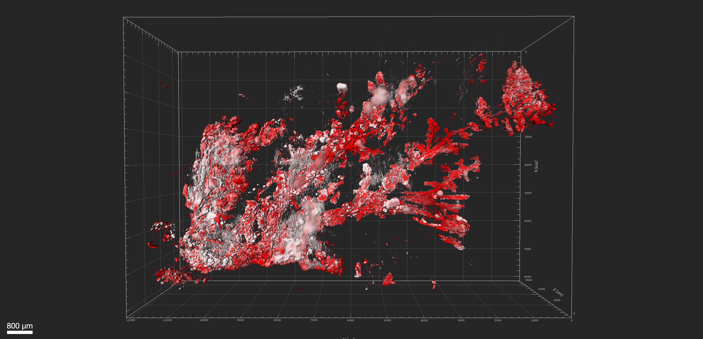

# Projects

## Current Research Projects

Here are some of my key research projects in computational biology with a focus on spatial biology applications in cancer research.

### Bone Marrow Microenvironment Changes

[{width=300}](subpages/bone-marrow-sennet.md)

[Learn more about this project](subpages/bone-marrow-sennet.md)

### 3D Morphological Changes in Cancer Progression

[{width=300}](subpages/precancer-cancer-3d.md)

[Learn more about this project](subpages/precancer-cancer-3d.md)

### Myosin Cluster Assembly in Adherent Cells

[{width=300}](subpages/myosin-clusters.md)

[Learn more about this project](subpages/myosin-clusters.md)